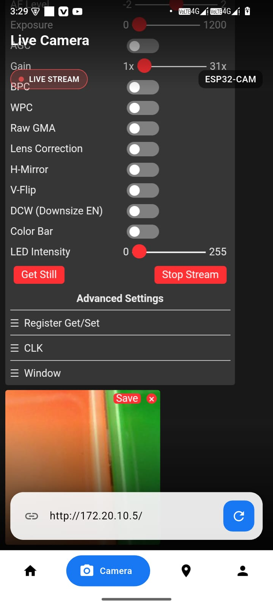
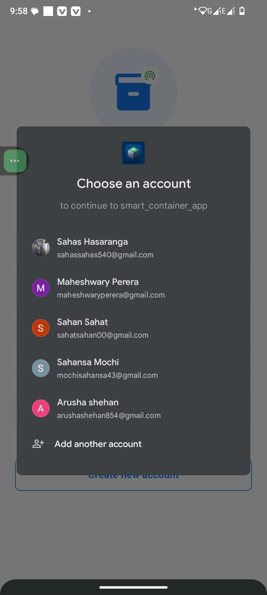
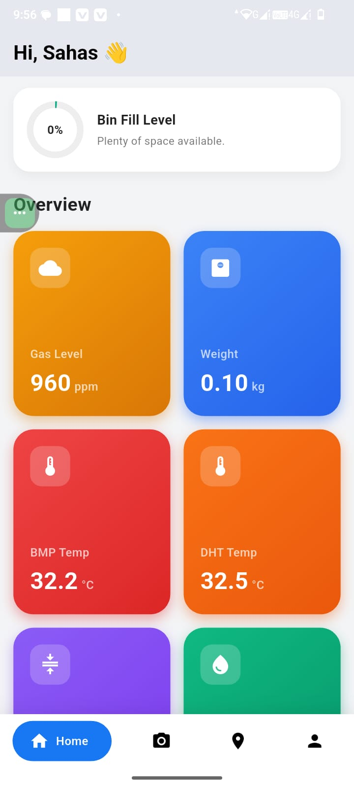
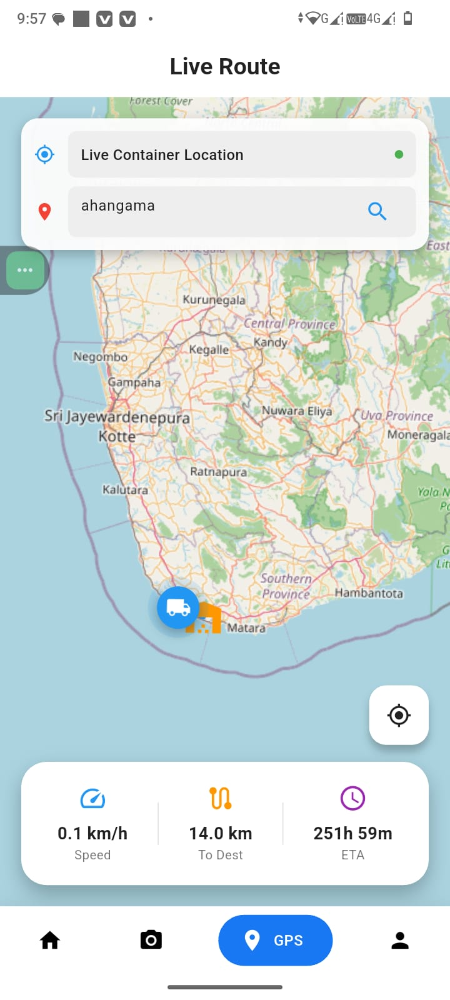

<div align="center">
  
  # 📦 Smart Container Box Mobile Application

  <p align="center">
    <strong>A next-generation IoT solution for real-time monitoring and tracking of Smart Container Boxes.</strong>
  </p>
  
  <p align="center">
    
    
    
    
  </p>

</div>

---

## 📑 Table of Contents
- [About the Project](#-about-the-project)
- [Key Features](#-key-features)
- [System Architecture](#-system-architecture)
- [Hardware Requirements](#-hardware-requirements)
- [Getting Started](#-getting-started)
- [Project Structure](#-project-structure)
- [License](#-license)

---

## 🚀 About the Project

The **Smart Container Box Mobile Application** is a professional, feature-rich Flutter application designed to interface seamlessly with IoT hardware. It provides end-users with real-time telemetry, live video surveillance, and pinpoint GPS tracking of their container boxes from anywhere in the world.

Built with performance and aesthetics in mind, the app features a responsive **Glassmorphism UI**, dynamic dark/light themes, and smooth micro-animations ensuring a premium user experience.

---

## ✨ Key Features

- **📊 Real-time Telemetry Dashboard** 
  - Live **Weight & Fill Level** monitoring.
  - Environmental tracking: **BMP/DHT Temperature**, **Humidity**, and **Pressure**.
  - Safety sensors: **Gas Level (ppm)** monitoring.
- **📹 Live Camera Streaming**
  - Ultra-low latency video stream directly from the **ESP32-CAM** module.
- **🗺️ Live GPS Tracking**
  - Integrated with **OSRM** (Open Source Routing Machine) to show accurate driving routes.
  - Real-time Distance and ETA calculations.
- **🔐 Secure Access**
  - Robust authentication powered by **Firebase Auth**.
- **🎨 Premium UI/UX Design**
  - Fully responsive, animated interfaces using `flutter_animate`.

---

## 📸 Screenshots

<p align="center">
  
  &nbsp;&nbsp;&nbsp;
  
  &nbsp;&nbsp;&nbsp;
  
  &nbsp;&nbsp;&nbsp;
  
</p>

---

## 🏗️ System Architecture

The ecosystem relies on three main components communicating in real-time:
1. **IoT Hardware (Smart Container):** Collects data from sensors (Load Cells, DHT11, BMP280, MQ Gas Sensor, GPS Module) and streams video via ESP32-CAM.
2. **Cloud Backend (Firebase):** Handles User Authentication and stores live telemetry via Realtime Database.
3. **Mobile Application (Flutter):** Subscribes to Firebase streams for UI updates and connects directly to the ESP32-CAM IP for video feed.

---

## 🔌 Hardware Requirements

To fully utilize this application, the Smart Container Box should be equipped with:
- **Microcontrollers**: NodeMCU / ESP8266 & ESP32-CAM
- **Sensors**: 
  - Load Cell (with HX711 Amplifier)
  - DHT11 / DHT22 (Temperature & Humidity)
  - BMP280 (Pressure & Temperature)
  - MQ Series Gas Sensor
  - Neo-6M GPS Module

---

## 🛠️ Getting Started

Follow these instructions to get a copy of the project up and running on your local machine for development and testing.

### Prerequisites
- [Flutter SDK](https://docs.flutter.dev/get-started/install) (latest stable version)
- Dart SDK
- Git
- IDE (VS Code or Android Studio)

### Installation

1. **Clone the repository**
   ```bash
   git clone https://github.com/sahas-hasaranga/Smart-Container-Box-Mobile-Application.git
   cd Smart-Container-Box-Mobile-Application
   ```

2. **Install dependencies**
   ```bash
   flutter pub get
   ```

3. **Configure Firebase**
   - Place your `google-services.json` file inside `android/app/`.
   - Update Firebase Configurations in `lib/firebase_options.dart`.

4. **Run the Application**
   ```bash
   flutter run
   ```

---

## 📂 Project Structure

```text
lib/
├── screens/           # UI Screens (Dashboard, Camera, GPS, Auth)
├── widgets/           # Reusable UI components (Buttons, Cards, Camera Views)
├── main.dart          # Entry point of the application
└── firebase_options.dart # Firebase configuration file
```

---

## 📄 License

This project is licensed under the **MIT License**. See the `LICENSE` file for more details.

<div align="center">
  <i>Developed with ❤️ using Flutter & Firebase.</i>
</div>
