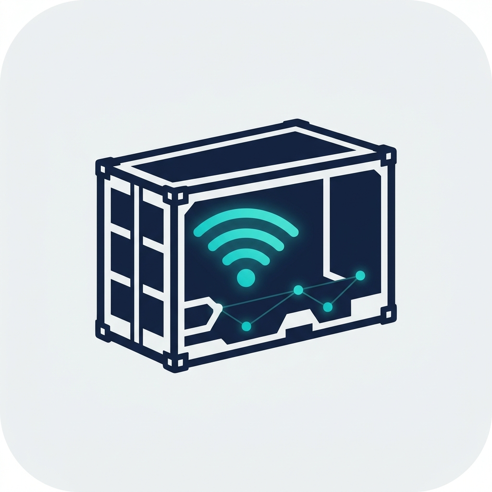
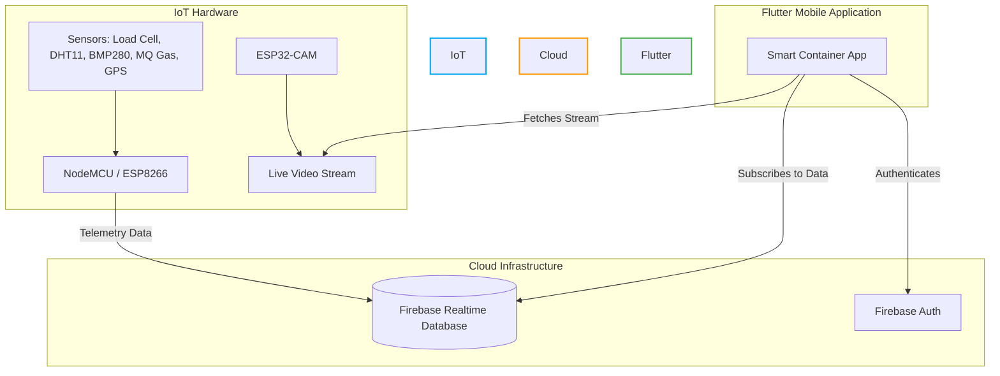

<div align="center">
  
  

  # 📦 Smart Container Box Mobile Application

  <p align="center">
    <strong>A next-generation IoT solution for real-time monitoring and tracking of Smart Container Boxes.</strong>
  </p>
  
  <p align="center">
    <a href="https://flutter.dev/"></a>
    <a href="https://dart.dev/"></a>
    <a href="https://firebase.google.com/"></a>
    <a href="https://www.espressif.com/"></a>
  </p>

  <p align="center">
    
    
    
    
    
  </p>

</div>

---

## 📑 Table of Contents
- [About the Project](#-about-the-project)
- [Key Features](#-key-features)
- [System Architecture](#-system-architecture)
- [Hardware Requirements](#-hardware-requirements)
- [Screenshots](#-screenshots)
- [Getting Started](#-getting-started)
- [Project Structure](#-project-structure)
- [Contributing](#-contributing)
- [License](#-license)

---

## 🚀 About the Project

The **Smart Container Box Mobile Application** is a professional, feature-rich Flutter application designed to interface seamlessly with IoT hardware. It provides end-users with real-time telemetry, live video surveillance, and pinpoint GPS tracking of their container boxes from anywhere in the world.

Built with performance and aesthetics in mind, the app features a responsive **Glassmorphism UI**, dynamic dark/light themes, and smooth micro-animations ensuring a premium user experience.

---

## ✨ Key Features

### 📊 Real-time Telemetry Dashboard
- Live **Weight & Fill Level** monitoring.
- Environmental tracking: **BMP/DHT Temperature**, **Humidity**, and **Pressure**.
- Safety sensors: **Gas Level (ppm)** monitoring.

### 📹 Live Camera Streaming
- Ultra-low latency video stream directly from the **ESP32-CAM** module.

### 🗺️ Live GPS Tracking
- Integrated with **OSRM** (Open Source Routing Machine) to show accurate driving routes.
- Real-time Distance and ETA calculations.

### 🔐 Secure Access
- Robust authentication powered by **Firebase Auth**.
- Secure Realtime Database rules for telemetry protection.

### 🎨 Premium UI/UX Design
- Fully responsive, animated interfaces using `flutter_animate`.
- Custom-built widgets for an immersive experience.

---

## 🏗️ System Architecture

The ecosystem relies on three main components communicating in real-time. 



---

## 🔌 Hardware Requirements

To fully utilize this application, the Smart Container Box should be equipped with:

| Component Category | Recommended Hardware | Purpose |
|--------------------|----------------------|---------|
| **Microcontrollers** | NodeMCU / ESP8266 | Main processing and data transmission. |
| **Camera Module** | ESP32-CAM | Live video surveillance streaming. |
| **Sensors** | Load Cell (with HX711) | Weight/Fill level calculation. |
| | DHT11 / DHT22 | Temperature & Humidity sensing. |
| | BMP280 | Pressure & precise Temperature sensing. |
| | MQ Series Sensor | Gas leakage / Air quality monitoring. |
| | Neo-6M GPS Module | Real-time location tracking. |

---

## 📸 Screenshots

<p align="center">
  
  &nbsp;&nbsp;
  
  &nbsp;&nbsp;
  
  &nbsp;&nbsp;
  
</p>

---

## 🛠️ Getting Started

Follow these instructions to get a copy of the project up and running on your local machine for development and testing.

### Prerequisites
- [Flutter SDK](https://docs.flutter.dev/get-started/install) (latest stable version)
- [Dart SDK](https://dart.dev/get-dart)
- [Git](https://git-scm.com/)
- IDE (VS Code or Android Studio)

### Installation

1. **Clone the repository**
   ```bash
   git clone https://github.com/sahas-hasaranga/Smart-Container-Box-Mobile-Application.git
   cd Smart-Container-Box-Mobile-Application
   ```

2. **Install dependencies**
   ```bash
   flutter pub get
   ```

3. **Configure Firebase**
   - Place your `google-services.json` file inside `android/app/`.
   - Update Firebase Configurations in `lib/firebase_options.dart`.

4. **Run the Application**
   ```bash
   flutter run
   ```

---

## 📂 Project Structure

```text
lib/
├── screens/           # UI Screens (Dashboard, Camera, GPS, Auth)
├── widgets/           # Reusable UI components (Buttons, Cards, Camera Views)
├── services/          # Business logic, API calls, and Firebase interactions
├── models/            # Data models and classes
├── main.dart          # Entry point of the application
└── firebase_options.dart # Firebase configuration file
```

---

## 🤝 Contributing

Contributions, issues, and feature requests are welcome! 
Feel free to check the [issues page](https://github.com/sahas-hasaranga/Smart-Container-Box-Mobile-Application/issues).

1. Fork the Project
2. Create your Feature Branch (`git checkout -b feature/AmazingFeature`)
3. Commit your Changes (`git commit -m 'Add some AmazingFeature'`)
4. Push to the Branch (`git push origin feature/AmazingFeature`)
5. Open a Pull Request

---

## 📄 License

This project is licensed under the **MIT License**. See the `LICENSE` file for more details.

<div align="center">
  <i>Developed with ❤️ using Flutter & Firebase.</i>
</div>
